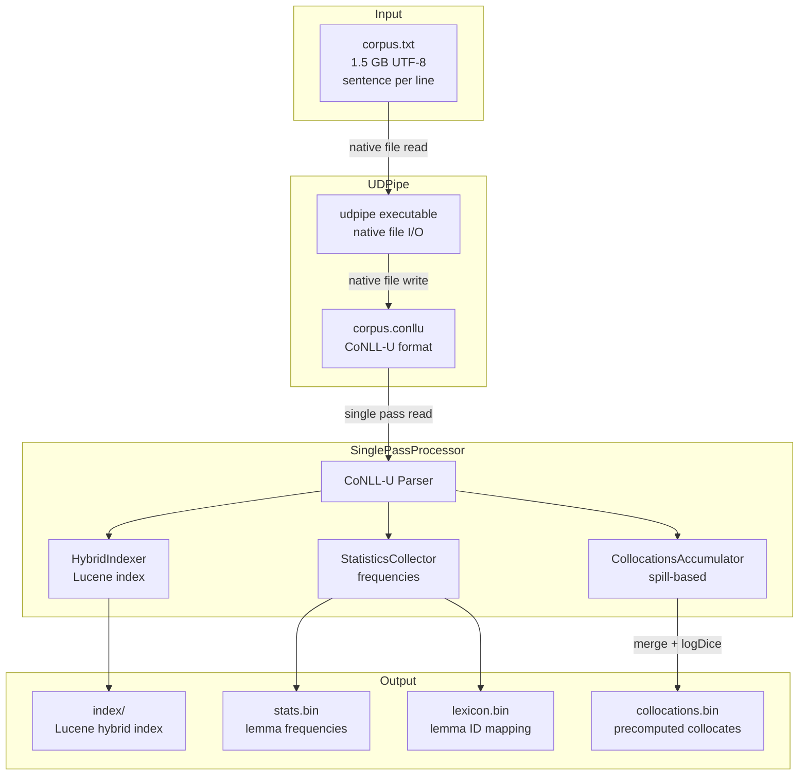

# Single-Pass Pipeline Design for UDPipe + Index + Collocations

**Date:** 2026-02-10  
**Status:** ✅ **IMPLEMENTED**  
**Target:** 1.5 GB UTF-8 corpus processing

## Implementation Links

| Component | File | Description |
|-----------|------|-------------|
| Core Processor | [`SinglePassConlluProcessor.java`](src/main/java/pl/marcinmilkowski/word_sketch/indexer/hybrid/SinglePassConlluProcessor.java) | Single-pass CoNLL-U processing |
| CLI Command | [`Main.java`](src/main/java/pl/marcinmilkowski/word_sketch/Main.java:735) | `single-pass` command handler |
| Pipeline Script | [`tag_and_build.ps1`](tag_and_build.ps1) | Complete PowerShell pipeline |

---

## Quick Start

### One-Command Pipeline (Recommended)

```powershell
# Process a corpus from start to finish:
.\tag_and_build.ps1 -CorpusFile corpus.txt -OutputDir index\
```

This single command:
1. Tags the corpus with UDPipe (POS tags, lemmas)
2. Builds the Lucene hybrid index
3. Computes collocations with logDice scores
4. Outputs ready-to-query index files

### Manual Step-by-Step

If you prefer to run steps individually:

```powershell
# Step 1: Tag with UDPipe (avoids Windows encoding issues)
udpipe --tokenizer=none --tag --parser=none model.udpipe corpus.txt --outfile=corpus.conllu

# Step 2: Single-pass index + collocations
java -Xmx8g -jar target/word-sketch-lucene-1.0.0.jar single-pass `
    --input corpus.conllu `
    --output index/ `
    --collocations index/collocations.bin
```

### Query the Results

```powershell
# Start the API server
java -jar target/word-sketch-lucene-1.0.0.jar server --index index/ --collocations index/collocations.bin
```

---

## Estimated Timing (1.5 GB Corpus)

| Stage | Time Estimate | Output Size |
|-------|---------------|-------------|
| UDPipe tagging | 45-90 minutes | ~3 GB CoNLL-U |
| Single-pass indexing + collocations | 30-60 minutes | ~2 GB index |
| **Total** | **~2-3 hours** | ~5 GB total |

*Timing varies based on CPU, disk speed, and corpus characteristics.*

---

## Architecture Overview



---

## Component Design

### 1. UDPipe Tagging Stage

**Command Line:**
```powershell
udpipe --tokenizer=none --tag --parser=none model.udpipe corpus.txt --outfile=corpus.conllu
```

**Key Options:**
| Option | Purpose |
|--------|---------|
| `--tokenizer=none` | Input is pre-tokenized (one sentence per line) |
| `--tag` | Run POS tagging and lemmatization |
| `--parser=none` | Skip dependency parsing (not needed for collocations) |
| `--outfile` | Output file path (native file I/O, UTF-8) |

**Windows UTF-8 Handling:**
- UDPipe reads/writes files natively with UTF-8 encoding
- Avoids PowerShell pipe encoding issues
- Input file must be UTF-8 without BOM (or with BOM, UDPipe handles both)

### 2. SinglePassConlluProcessor

**Implemented Class:** [`SinglePassConlluProcessor.java`](src/main/java/pl/marcinmilkowski/word_sketch/indexer/hybrid/SinglePassConlluProcessor.java)

This class combines functionality from:
- [`HybridConllUProcessor`](src/main/java/pl/marcinmilkowski/word_sketch/indexer/hybrid/HybridConllUProcessor.java) - CoNLL-U parsing and indexing
- [`CollocationsBuilderV2`](src/main/java/pl/marcinmilkowski/word_sketch/indexer/hybrid/CollocationsBuilderV2.java) - Spill-based cooccurrence counting

**Class Structure:**
```java
public class SinglePassConlluProcessor implements Closeable {
    
    // Core components (reused from existing classes)
    private final HybridIndexer indexer;
    private final AtomicInteger sentenceId = new AtomicInteger(0);
    private final AtomicLong tokenCount = new AtomicLong(0);
    
    // Collocations accumulation (from CollocationsBuilderV2)
    private final LongIntHashMap[] shardMaps;
    private final int numShards;
    private final int spillThreshold;
    private final Path workDir;
    private int runId = 0;
    
    // Configuration
    private int windowSize = 5;
    private int topK = 100;
    private int minHeadwordFrequency = 10;
    private int minCooccurrence = 2;
    
    public void processFile(String inputFile) throws IOException { ... }
    public void processDirectory(String directory, String pattern) throws IOException { ... }
    public void close() throws IOException { ... }
}
```

### 3. Processing Flow

#### During `processFile()`:

```java
for each sentence in CoNLL-U file:
    1. Parse sentence into token list
    2. Build SentenceDocument with lemma IDs
    3. Index sentence via HybridIndexer
    4. For each token position i:
         For each position j in [i-window, i+window]:
             if j != i:
                 pairKey = (lemmaId[i], lemmaId[j])
                 shardMaps[shard(pairKey)].addTo(pairKey, 1)
    5. Periodically check memory and spill if needed
```

#### During `close()`:

```java
1. Commit Lucene index
2. Write stats.tsv, stats.bin
3. Write lexicon.bin (lemma -> ID -> frequency -> POS)
4. Final spill of remaining in-memory pairs
5. For each shard:
     Merge spilled runs
     Aggregate counts per (headId, collId)
     For each headId:
         Filter by minCooccurrence
         Compute logDice using frequencies
         Keep topK by logDice
         Write CollocationEntry
6. Write collocations.bin header and offset table
```

---

## Memory Management

### Memory Estimate for 1.5 GB Corpus

| Metric | Estimate |
|--------|----------|
| Tokens | ~75 million |
| Unique lemmas | ~500,000 |
| Unique pairs (window=5) | ~50-100 million |
| Memory per pair (LongIntHashMap) | ~12 bytes |
| Total pair memory | ~600 MB - 1.2 GB |

### Spill Strategy

The spill mechanism from [`CollocationsBuilderV2`](src/main/java/pl/marcinmilkowski/word_sketch/indexer/hybrid/CollocationsBuilderV2.java) is reused:

1. **Sharding:** Pairs distributed across N shards (default: 64) by `headId & (numShards - 1)`
2. **Spill Trigger:** When any shard exceeds threshold (default: 2M pairs)
3. **Spill Action:** Sort pairs by key, write to run file, clear shard map
4. **Merge Phase:** Multi-way merge of run files per shard

**Run File Format:** (from [`PairRunIO`](src/main/java/pl/marcinmilkowski/word_sketch/indexer/hybrid/PairRunIO.java))
```
Header:
  magic: int (0x50414952 = "PAIR")
  version: int
  recordCount: int

Records (repeated):
  pairKey: long ((headId << 32) | collId)
  count: int
```

---

## CLI Commands

### single-pass Command

**Implemented in:** [`Main.java:735`](src/main/java/pl/marcinmilkowski/word_sketch/Main.java:735)

```bash
java -Xmx8g -jar target/word-sketch-lucene-1.0.0.jar single-pass \
    --input corpus.conllu \
    --output index/ \
    --collocations index/collocations.bin \
    [--commit 50000] \
    [--memory 10000000] \
    [--window 5] \
    [--top-k 100] \
    [--min-freq 10] \
    [--min-cooc 2]
```

**Options:**
| Option | Default | Description |
|--------|---------|-------------|
| `--input`, `-i` | (required) | CoNLL-U file or directory |
| `--output`, `-o` | (required) | Output index directory |
| `--collocations`, `-c` | `<output>/collocations.bin` | Collocations file path |
| `--commit` | 50000 | Lucene commit interval |
| `--memory` | 10000000 | Max in-memory collocation entries |
| `--window` | 5 | Collocation window size |
| `--top-k` | 100 | Max collocates per headword |
| `--min-freq` | 10 | Minimum headword frequency |
| `--min-cooc` | 2 | Minimum cooccurrence count |

---

## PowerShell Script

**Implemented File:** [`tag_and_build.ps1`](tag_and_build.ps1)

### Usage

```powershell
# Basic usage
.\tag_and_build.ps1 -CorpusFile corpus.txt -OutputDir index\

# With custom options
.\tag_and_build.ps1 -CorpusFile corpus.txt -OutputDir index\ -Model english-ewt.udpipe -TopK 200

# Keep intermediate CoNLL-U file
.\tag_and_build.ps1 -CorpusFile corpus.txt -OutputDir index\ -KeepConllu
```

### Parameters

| Parameter | Required | Default | Description |
|-----------|----------|---------|-------------|
| `-CorpusFile` | Yes | - | Input corpus file (UTF-8) |
| `-OutputDir` | Yes | - | Output directory |
| `-Model` | No | `english-ewt.udpipe` | UDPipe model file |
| `-CommitInterval` | No | 50000 | Lucene commit interval |
| `-MemoryLimit` | No | 10000000 | Max in-memory entries |
| `-TopK` | No | 100 | Max collocates per headword |
| `-KeepConllu` | No | false | Keep intermediate CoNLL-U |

---

## UDPipe Command Reference

### Basic Syntax
```
udpipe [running_opts] udpipe_model [input_files] --outfile=output_template
```

### Common Options

| Option | Description |
|--------|-------------|
| `--tokenizer=none` | Skip tokenization (input pre-tokenized) |
| `--tokenizer=pretokenized` | Input is pre-tokenized by whitespace |
| `--tag` | Run POS tagger |
| `--parser=none` | Skip dependency parser |
| `--outfile` | Output file path or template |

### Output Templates
- `%f` - Original filename
- `%e` - Original extension
- Example: `--outfile=output/%f.conllu`

### Windows-Specific Notes

1. **File Encoding:**
   - UDPipe reads/writes UTF-8 natively
   - No BOM issues with file I/O
   - Avoid piping through PowerShell (encoding issues)

2. **Path Handling:**
   - Use full paths or relative to current directory
   - Forward slashes work in most cases
   - Backslashes may need escaping in some contexts

3. **Memory:**
   - UDPipe is memory-efficient
   - For 1.5 GB corpus, ~2-4 GB RAM sufficient

### Example Commands

```powershell
# Basic tagging (pre-tokenized input)
udpipe --tokenizer=none --tag --parser=none model.udpipe input.txt --outfile=output.conllu

# With dependency parsing (slower, more features)
udpipe --tokenizer=none --tag --parser model.udpipe input.txt --outfile=output.conllu

# Process multiple files
udpipe --tag model.udpipe file1.txt file2.txt --outfile=tagged/%f.conllu
```

---

## Performance Expectations

### For 1.5 GB Corpus (~75M tokens)

| Stage | Time Estimate | Disk I/O |
|-------|---------------|----------|
| UDPipe tagging | 45-90 min | Read 1.5 GB, Write ~3 GB |
| Single-pass processing | 30-60 min | Read ~3 GB CoNLL-U once |
| **Total** | **~2-3 hours** | **~7.5 GB total reads** |

### Comparison with Two-Pass Approach

| Approach | CoNLL-U Reads | Index Reads | Total I/O |
|----------|---------------|-------------|-----------|
| Two-pass (previous) | 1× | 1× | ~9 GB |
| Single-pass (implemented) | 1× | 0× | ~6 GB |

**Savings:** ~33% reduction in I/O for collocations stage

---

## Testing Strategy

### Unit Tests

1. **SinglePassConlluProcessorTest**
   - Small corpus (100 sentences)
   - Verify index contents match HybridConllUProcessor
   - Verify collocations match CollocationsBuilderV2 output

2. **Integration Test**
   - Compare single-pass output vs. two-pass output
   - Use existing test corpus in `test-data/`

### Validation

```bash
# Build with single-pass
java -jar word-sketch-lucene.jar single-pass \
    --input test-data/sample-10k.conllu \
    --output test-output/

# Build with two-pass
java -jar word-sketch-lucene.jar hybrid-index \
    --input test-data/sample-10k.conllu \
    --output test-output-two-pass/
java -cp target/word-sketch-lucene-1.0.0.jar \
    pl.marcinmilkowski.word_sketch.indexer.hybrid.CollocationsBuilderV2 \
    test-output-two-pass/ test-output-two-pass/collocations.bin

# Compare collocations.bin files
diff <(xxd test-output/collocations.bin) <(xxd test-output-two-pass/collocations.bin)
```

---

## Implementation Checklist

- [x] Create `SinglePassConlluProcessor.java`
- [x] Add `single-pass` command to `Main.java`
- [x] Create `tag_and_build.ps1` script
- [ ] Add unit tests for `SinglePassConlluProcessor`
- [ ] Add integration test comparing single-pass vs two-pass
- [ ] Update documentation (README.md)
- [ ] Test with 1.5 GB corpus

---

## Appendix: Existing Components Reused

| Component | File | Purpose |
|-----------|------|---------|
| HybridIndexer | `hybrid/HybridIndexer.java` | Lucene sentence indexing |
| StatisticsCollector | `hybrid/HybridIndexer.java` | Lemma frequency counting |
| LemmaIdAssigner | `hybrid/LemmaIdAssigner.java` | Lemma → ID mapping |
| LongIntHashMap | `hybrid/LongIntHashMap.java` | Primitive pair → count map |
| PairRunIO | `hybrid/PairRunIO.java` | Spill file I/O |
| CollocationsBinWriter | `hybrid/CollocationsBinWriter.java` | Final collocations.bin output |
| LemmaLexiconWriter | `hybrid/LemmaLexiconWriter.java` | lexicon.bin output |
| TokenSequenceCodec | `hybrid/TokenSequenceCodec.java` | Token encoding for DocValues |
| LemmaIdsCodec | `hybrid/LemmaIdsCodec.java` | Lemma ID encoding |
